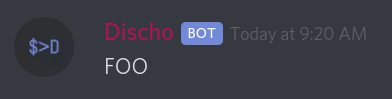
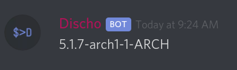

# Discho

*Pronounced Dis - Ko*
*Discord Echo*


**What it does:** Allows you to pipe input from bash and have it output to a discord channel, and upload local files / scripts

## Usage:

```bash
echo "FOO" | discho
```



```bash
scrot ~/scrot.png && echo "My Desktop!" | discho -u ~/scrot.png
```


```bash
echo "my config" | discho -cb ~/.keebie/default.json
```


```bash
uname  -r | discho -c general
```




## **Installation**

**Prerequisites:** 
Node.JS, jq, bash

Copy all files to ~/.discho, then run 

```bash
./discho install 
```

Now, you can run

```bash
discho -t whateveryourbottokenis 
```

to set your bot token

from `discho -h`...

```bash
Discho by Elisha Shaddock
discho -c <channel-name> to send to a specific channel. defaults to 'general', and stays on the last one you sent to
discho -t <TOKEN> sets bot token for the bot
discho -u <FILEPATH> will upload this file as an attachement. Append -c <channel-name> to specify a channel, otherwise it will send to the last used
discho -cb <FILEPATH> will upload this file as an attatchement, and attempt to post its content as a code block using its file extension as the syntax
discho -h shows this
discho install: installs this script to /usr/bin/ for systemwide use
```

